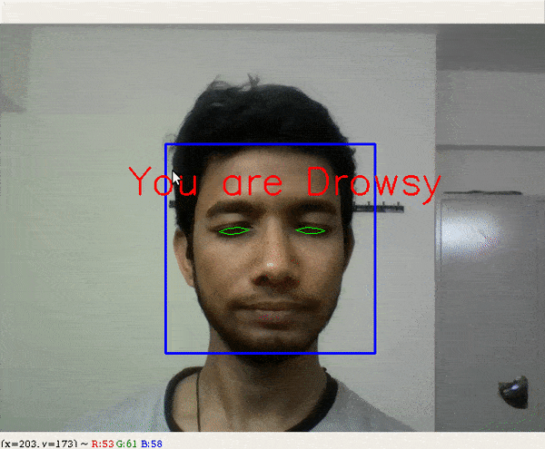

# smart-drive-assist
Vehicle Maintenance Prediction, Lane and Drowsiness Detection using Machine Learning

**Vehicle Maintenance Prediction**  
1.Hierarchical modified fuzzy support vector machine used for the prediction of vehicle attributes like mileage, age of vehicle etc.  
2.Proposed method is compared with some approaches like support vector machine, random forests, logistic regression.  

**Drivers Drowsiness Detection**  
1.For reducing the number of accidents, a module for Advanced Driver Assistance System is presented.  
2.An algorithm will be presented for locating, analyzing the drivers face and eyes.  

**Lane Detection**  
1.Using a system which can effectively identify the lane on the smooth roads.   
2.For identification of lane lines Gradient and HLR thresholding are used.  

For more info, read https://www.ijcaonline.org/archives/volume175/number37/sanath-2020-ijca-920948.pdf  

  

  
